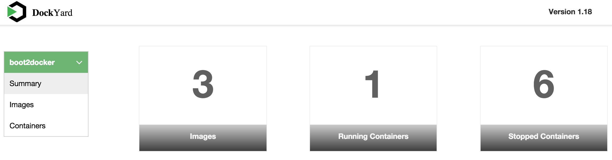
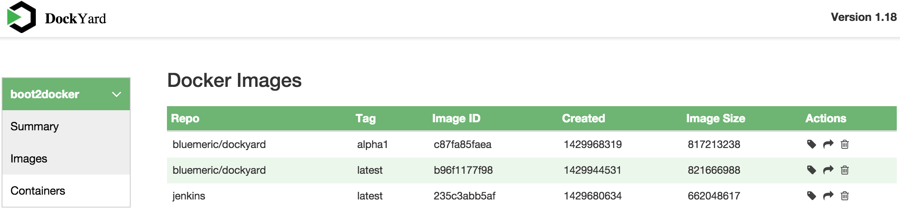
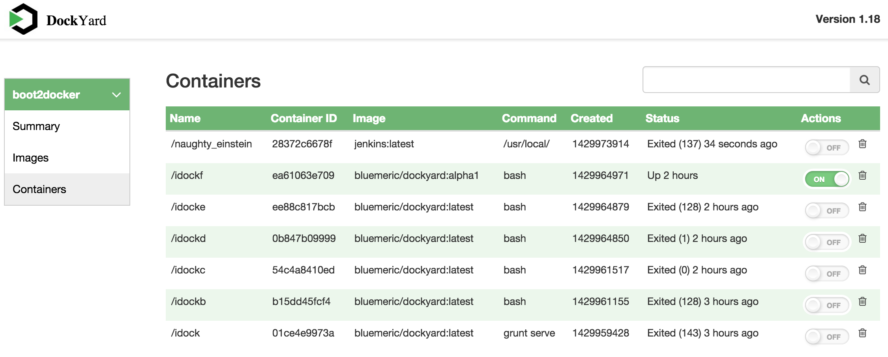

# DockYard
DockYard is a docker management tool that can manage docker images and containers running on a Linux, Windows or Mac OS X.  DockYard runs as a docker container and thus it is platform neutral.

By integrating the docker hosts across these different environments in to a single management window, the developement, QA and Ops teams can create and share these images and containers.

## Features Supported

* Summary of enviroment
* Listing Containers
* Listing Images
* State of Containers (Started or Stopped)

## Platforms Tested
* Docker version 1.6.0 
* Linux all flavors
* Boot2Docker v1.6.0 (Mac OSX 10.10.3 , Windows 7)


## Prerequisites
- nodejs v0.10.33
- npm v1.4.28

### Docker Environment Setup

```sh
$ sudo apt-get update
$ sudo apt-get -q -y install nodejs npm ruby ruby-dev rubygems-integration
$ npm install -g grunt-cli
$ npm install -g bower
$ npm install -g grunt-contrib-compass 
$ sudo gem install sass
$ sudo gem install compass
$ cd $SOURCE
$ npm install --save
$ npm install grunt-contrib-compass --save
$ bower install --save --allow-root --force-latest --config.interactive=false
$ ./grunt serve --force
```

## DockYard Installation

### Enable Docker API
Check if docker daemon is running. If so, restart the docker daemon with the following options
```sh
$ sudo docker -H tcp://0.0.0.0:5000 -H unix:///var/run/docker.sock -d &
```

### Build Dockyard Environment

```sh
$ sudo docker pull bluemeric/dockyard:alpha1

$ sudo docker run --name idock  -it -p "9000:9000" bluemeric/dockyard

```
## DockYard Dashboard



## DockYard Images 



## DockYard Containers



#License
DockYard is licensed under Apache License, Version 2.0. See [LICENSE](LICENSE) for the full license text.

